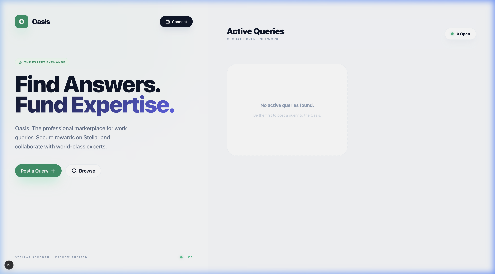
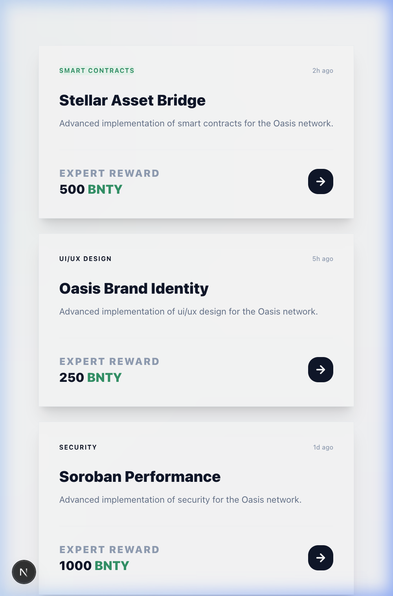

# 🌌 WorkCounter | The Expert Exchange

**Find Answers. Fund Expertise.**

WorkCounter is a professional, high-fidelity marketplace for work queries and expert collaboration, built on the **Stellar Soroban** network. It bridges the gap between complex problems and specialized knowledge through a secure, escrow-backed reward system.



## ✨ Premium Features

- **Interactive Depth GUI**: An atmospheric user interface featuring 3D parallax effects, ambient motion, and a minimalist design aesthetic.
- **Stellar-Powered Escrow**: All rewards are secured via Soroban smart contracts, ensuring trustless payments upon successful query resolution.
- **Dynamic 3D Workspace**: Query cards feature physical tilt interactions and staggered entrance animations for a tactile, responsive feel.
- **Expert-Centric Flow**: Seamlessly transition from "Querying" to "Solving" with a unified dashboard and real-time status tracking.

## 📱 Mobile-First Architecture

WorkCounter is fully responsive, bringing the same high-end atmospheric experience to mobile devices.

<p align="center">
  
  
</p>

## 🛠️ Technology Stack

- **Frontend**: Next.js 15 (App Router), TypeScript, Tailwind CSS v4.
- **Motion**: Framer Motion (3D Parallax, Physics-based transitions).
- **Blockchain**: Stellar Soroban (Smart Contracts), Freighter Wallet integration.
- **Styling**: Custom CSS-in-JS primitives for "Atmospheric" glows and blurs.

## 🏗️ Architecture

### Smart Contracts (Soroban)
- **WorkBoard**: Manages query creation, metadata storage, and solver indexing.
- **Escrow**: Handles the lifecycle of WRKC tokens, locking funds during active queries and releasing them upon expert verification.

### Data Flow
1. **Initiate**: A user posts a query with a WRKC reward.
2. **Escrow**: Funds are automatically locked in the Soroban escrow contract.
3. **Resolve**: Experts submit solutions; the querier verifies and approves.
4. **Disburse**: The contract releases rewards directly to the expert's wallet.

## 🚀 Getting Started

### Prerequisites
- Node.js 20+
- Freighter Wallet (configured for Testnet)

### Installation

1. **Clone the repository**
   ```bash
   git clone https://github.com/namandeep-jindal/workcounter.git
   cd workcounter
   ```

2. **Install dependencies**
   ```bash
   npm install
   ```

3. **Environment Setup**
   Create a `.env.local` file:
   ```env
   NEXT_PUBLIC_SOROBAN_NETWORK=testnet
   NEXT_PUBLIC_BOUNTY_CONTRACT_ID=...
   ```

4. **Run Development Server**
   ```bash
   npm run dev
   ```

## 🧪 Testing Contracts

WorkCounter uses Cargo for smart contract development and testing.

1. **Navigate to the contracts directory**
   ```bash
   cd contracts
   ```

2. **Run contract tests**
   ```bash
   cargo test
   ```

3. **Check specific contract tests**
   ```bash
   cargo test --package work_board
   ```

## 🔒 Security

WorkCounter implements strict role-based access control and audited escrow logic to protect both queriers and experts. All contract interactions are signed via Freighter, ensuring user-controlled security at every step.

**Built with ❤️ for the Stellar Ecosystem.**
